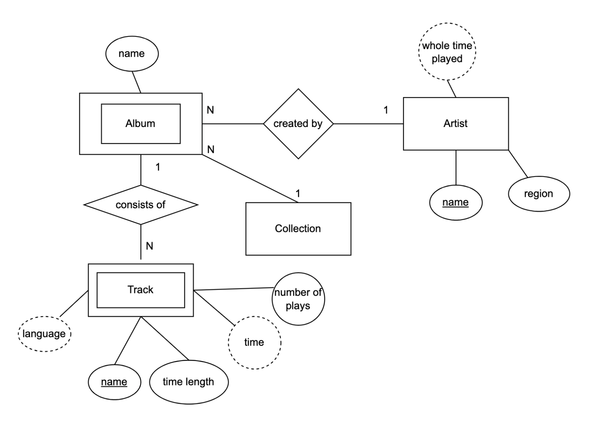

# The Music Database
The music database stores details of a personal music library, and could be used to manage your MP3, CD, or vinyl collection. Because this
database is for a personal collection, it’s relatively simple and stores only the relationships between artists, albums, and tracks. It ignores the
requirements of many music genres, making it most useful for storing popular music and less useful for storing jazz or classical music.

We first draw up a clear list of requirements for our database:
- The collection consists of albums.
- An album is made by exactly one artist.
- An artist makes one or more albums.
- An album contains one or more tracks.
- Artists, albums, and tracks each have a name.
- Each track is on exactly one album.
- Each track has a time length, measured in seconds.
- When a track is played, the date and time the playback began (to the nearest second) should be recorded; this is used for reporting when a
track was last played, as well as the number of times music by an artist, from an album, or a track has been played.

There’s no requirement to capture composers, group members or sidemen, recording date or location, the source media, or any other details of
artists, albums, or tracks.

[View PDF](./lab1.drawio.pdf)

