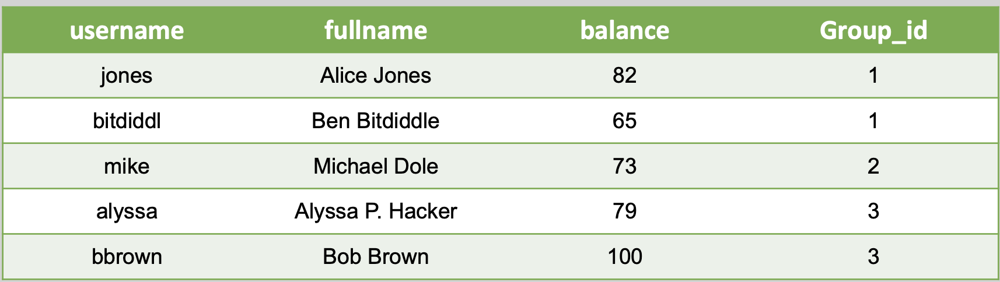
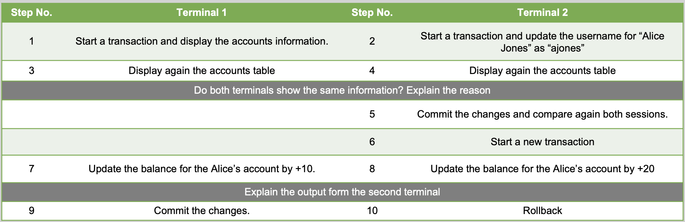

# Transactions control
## Exercise 1 (Banking transactions) 
### Part 1 
Create a table of accounts

Each account should have:
- A unique ID
- Name
- Credit
- Currency

Generate and insert 3 accounts into the table, each account has 1000 Rub.

Create Transactions:
- T1 : Account 1 send 500 RUB to Account 3
- T2: Account 2 send 700 RUB to Account 1
- T3: Account 2 send to 100 RUB to Account 3

Return Credit for all Account

Create Rollback for T1,T2,T3.

### Part 2
Add this field:
- BankName
  
Account 1 & 3 is SberBank, Account 2 is Tinkoff

Define the following conditions for each transaction
- Internal transaction’s fee is 0 RUB.
- External transaction’s fee is 30 RUB.

Fees Should be saved in new Record (Account 4)

Generate and insert 3 accounts into the table, each account has 1000 Rub.

Create Transactions:
- T1 : Account 1 send 500 RUB to Account 3
- T2: Account 2 send 700 RUB to Account 1
- T3: Account 2 send to 100 RUB to Account 3
- Return Credit for all Account

Create Rollback for T1,T2,T3.

### Part 3
Create new Table Called Ledger to show all transactions:
- ID (unique)
- From (ID)
- To (ID)
- Fee (RUB)
- Amount (RUB)
- TransactionDateTime (DateTime)

Modify Part 1 & 2 To save all transaction inside this table

## Exercise 2 (Isolation level)
Create a table account as the following example:

Test with Read committed, Repeatable read isolation levels 

Connect to your database using postgres CLI from 2 different sessions to: 

Test with Read committed, Repeatable read isolation levels:
- Start a transaction (T1 & T2)
- Read accounts with group_id=2 (T1).
- Move Bob to group 2(T2).
- Read accounts with group_id=2 (T1).
- Update selected accounts balances by +15 (T1).
- Commit transaction (T1 & T2).
- Explain the result for both isolation levels.

[Solution](./solution.sql)
