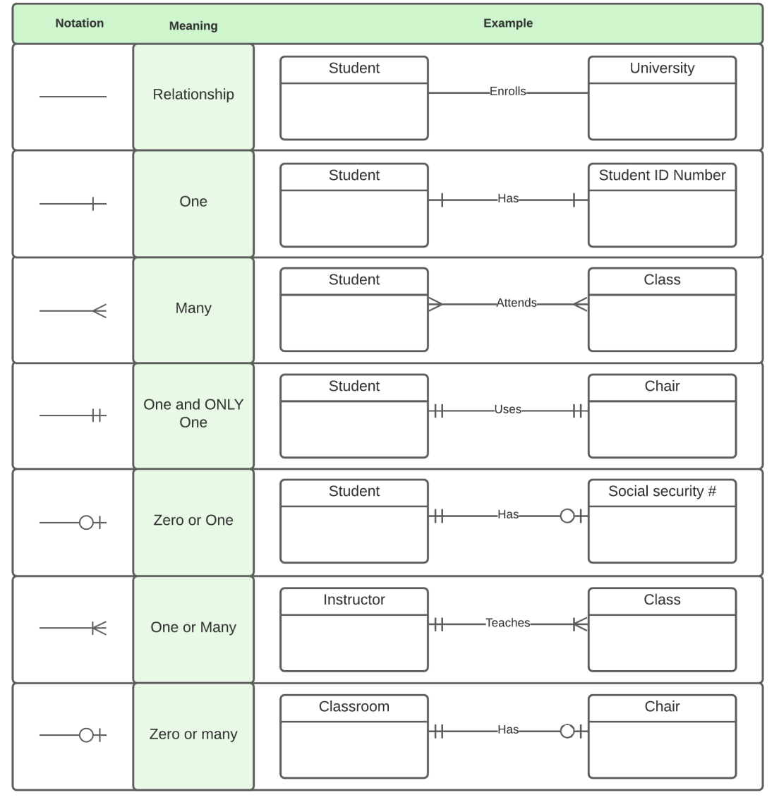

# UML notation for ER diagrams
## Exercise I
Consider the following set of requirements for a UNIVERSITY database that is used to keep track of students’ transcripts.
- For which it is necessary to keep a record of the students enrolled in the university, and the faculties in which they are enrolled, it is worth
mentioning that each faculty has a director and a number of assigned professors, as well as a list of the courses that said faculty can offer.
- Regarding the students, it should be considered that at the beginning of the program, each student is assigned to a specific group, in this way,
the class can be scheduled properly.
- Additionally, regarding students’ transcripts, it is important to record the grade, both in numerical and the letter format, and a record of each of
time that the student attempted to pass the course.

Based on the requirements presented previously, draw an ER diagram using Chen notation, please try to enrich the diagram with the attributes and relationships that you consider convenient

[Solution](./lab2.pdf)

## Exercise II
#### Taking the diagram drawn in exercise I, draw a new diagram following the UML notation and in which the following constraints must be included.
Some professors may be part of different faculties.

Every faculty needs to have a director.

The professors can teach the same course in several semesters, and each time the course is taught it must be recorded.

Every student must be enrolled in only one group, however, the students can be enrolled in different faculties, to keep track of the
programs they have completed.

Every professors should teach some course, and each course must be taught by some teacher.

Remember it not allowed the professors to be enrolled more than once in the same course during the same semester, as it could lead to
have scheduling problems.

[Solution](./lab2ex2.pdf)

## UML Notation: 

