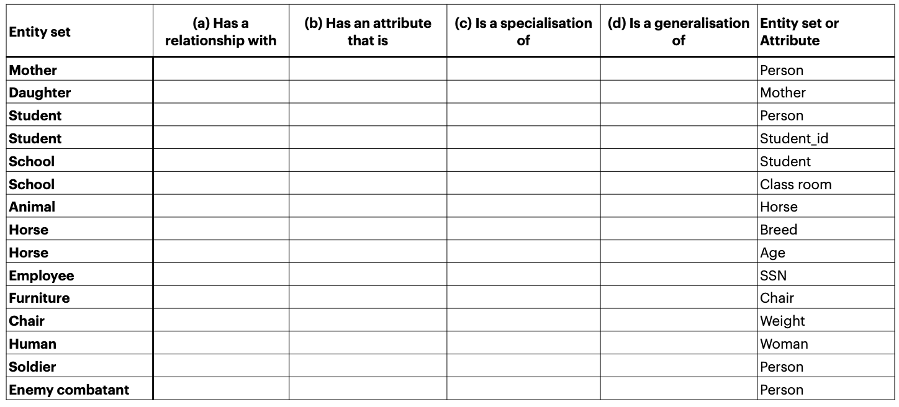
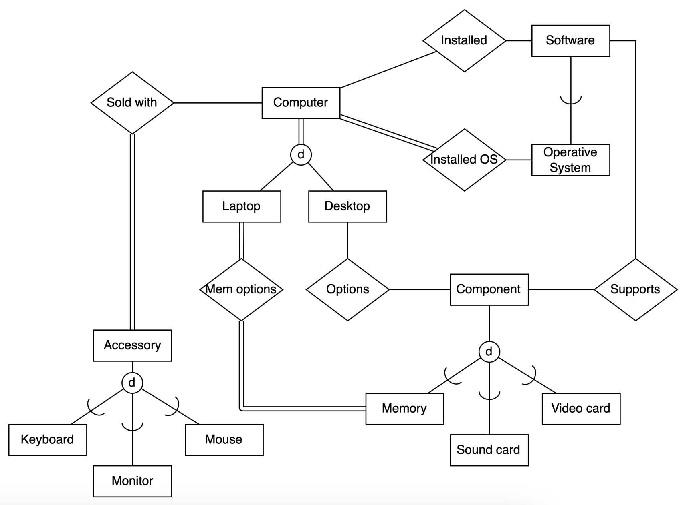

# Enhanced ER diagram
## Exercises I
Consider the entity sets and attributes shown in the following table. Place
a checkmark in one column in each row to indicate the relationship
between the far left and far right columns.
• The left side has a relationship with the right side (a).
• The right side is an attribute of the left side (b).
• The left side is a specialization of the right side (c).
• The left side is a generalization of the right side (d).

[Solution](./Ex1.pdf)

## Exercises II
• We have 10 people. These people have different roles: some of them are students, some of them
are employees. It should be noted that for all of them we need to keep a record of their National
ID, name, Date of Birth, etc. However, both of these categories can have different attributes.

• For example, if the person is an employee, that means that the person can have a certain
company role. E.g. it might have a technical background with specialization in a specific field or
he/she can be a secretary. All employees of these people can be associated with different
company departments and salary levels. based on their performance and seniority level. On the
other hand, students can be freshman, sophomore, junior or senior. The sophomore and junior
have a major subject, while the senior also have a major, but additionally he/she has an adviser
for this thesis).

• Create EER Diagram to describe this scenario.

[Solution](./ex2.drawio.pdf)

## Exercises III
• Consider the following EER diagram that describes the computer systems at a company.
• Provide your own attributes and key for each entity type. Supply max cardinality constraints justifying your choice.
• Write a complete narrative description of what this EER diagram represents.

[Solution](./ex3.pdf)
[Description](./ex3%20Description)

