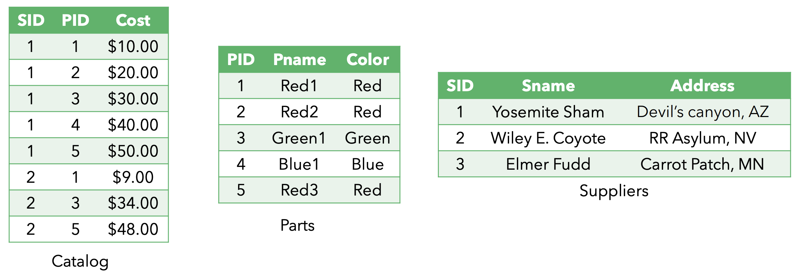

# Relational Algebra
## Exercise I
Consider following schema:
**Suppliers** (sid: integer, sname: string, address: string)
**Parts** (pid: integer, pname: string, color: string)
**Catalog** (sid: integer, pid: integer, cost: real) 

Convert the following statements to relation algebra
Find the names of suppliers who supply some red part.
Find the sids of suppliers who supply some red or green part.
Find the sids of suppliers who supply some red part or are at 221 Packer Street.
Find the sids of suppliers who supply some red part and some green part.
Find the sids of suppliers who supply every part.
Find the sids of suppliers who supply every red part.
Find the sids of suppliers who supply every red or green part.
Find the sids of suppliers who supply every red part or supply every green part.
Find pairs of sids such that the supplier with the first sid charges more for some part than the supplier with the second sid.
Find the pids of parts supplied by at least two different suppliers.

REFERENCE:

[Solution](./ex1.pdf)

## Exercise II
For the previous schema, state what the following queries compute:
- $\Pi_{sname}(\Pi_{sid}((\sigma_{color=red} \text{Parts}) \Join (\sigma_{cost<100} \text{Catalog})) \Join \text{Suppliers})$
- $(\Pi_{sname}((\sigma_{color=red} \text{Parts}) \Join (\sigma_{cost<100} \text{Catalog})) \Join \text{Supliers}) \cap (\Pi_{sname} ((/sigma_{color=green} \text{Parts}) \Join (\sigma_{cost<100} text{Catalog}) \Join \text{Suppliers}))$
