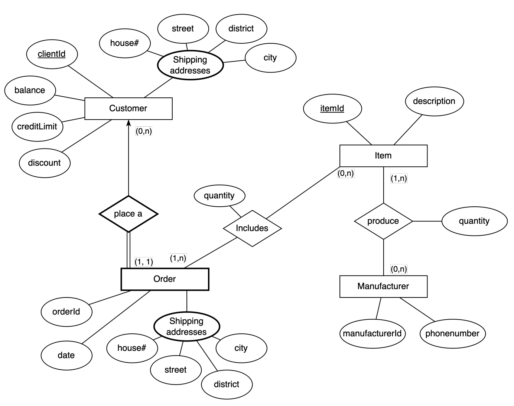
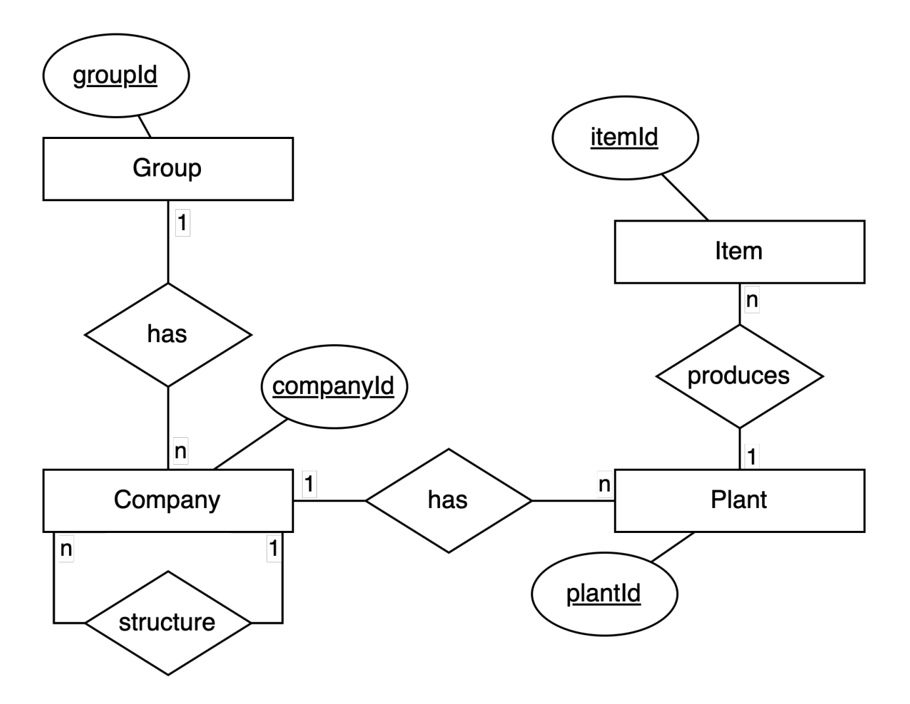
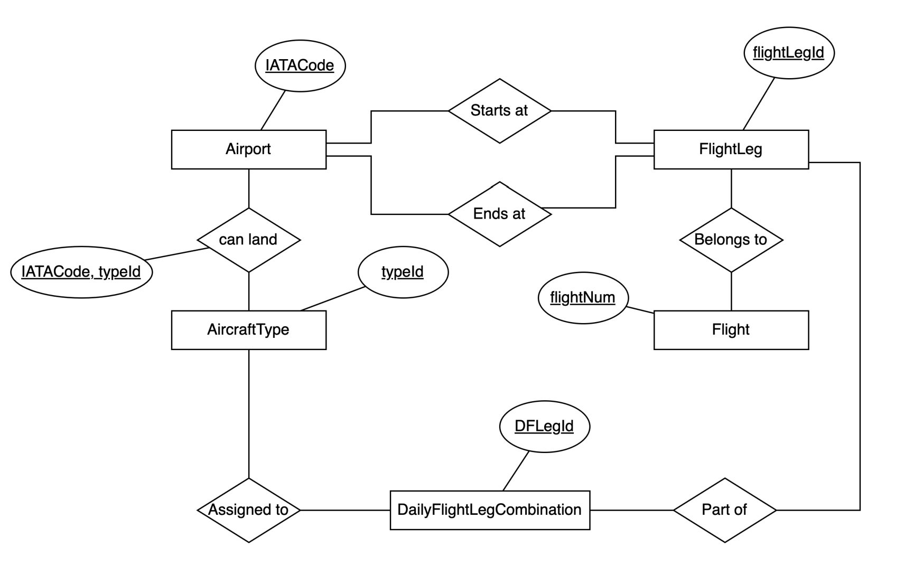

# From ERD to Relational Schema
## Exercises I
From the following ERD implement its Relational schema:

[Solution](./ex1.pdf)

## Exercises II
From the following ERD implement its Relational schema:

[Solution](./ex2.pdf)

## Exercises III
From the following ERD implement its Relational schema:

[Solution](./ex3.pdf)

## Exercises IV
From description, implement its relational schema for a dealership who sells both new and used cars, and it operates a
service facility.

Base your design on the following business rules:
- A salesperson may sell many cars, but each car is sold by only one salesperson.
- A customer may buy many cars, but each car is bought by only one customer.
- A salesperson writes a single invoice for each car he or she sells.
- A customer gets an invoice for each car he or she buys.
- A customer may come in just to have his or her car serviced; that is, a customer need not buy a car to be classified as a customer.
- When a customer takes one or more cars in for repair or service, one service ticket is written for each car.
- The car dealership maintains a service history for each of the cars serviced. The service records are referenced by the car’s serial number.
- A car brought in for service can be worked on by many mechanics, and each mechanic may work on many cars.
- A car that is serviced may or may not need parts (e.g., adjusting a carburetor or cleaning a fuel injector nozzle does not require providing new parts).

[Solution](./ex4.pdf)
