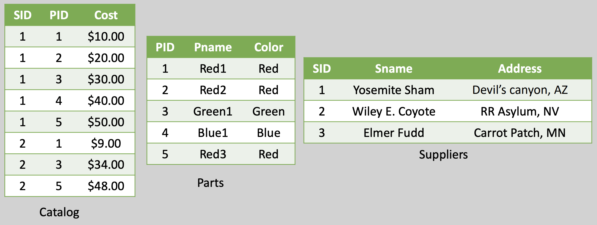
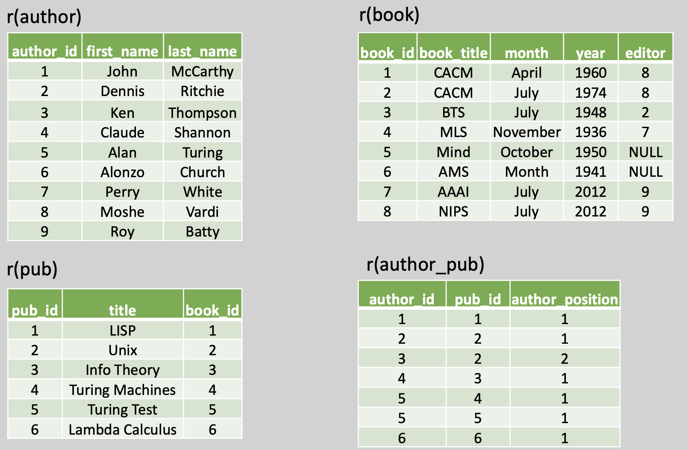

# Structured Query Language(SQL)
## Exercise 1
Consider following schema:
**Suppliers**(sid: integer, sname: string, address: string)
**Parts**(pid: integer, pname: string, color: string)
**Catalog**(sid: integer, pid: integer, cost: real)

Convert the following statements in a SQL query:
- Find the names of suppliers who supply some red part.
- Find the sids of suppliers who supply some red or green part.
- Find the sids of suppliers who supply some red part or are at 221 Packer Street.
- Find the sids of suppliers who supply every red or green part.
- Find the sids of suppliers who supply every red part or supply every green part.
- Find pairs of sids such that the supplier with the first sid charges more for some part than the supplier with the second sid.
- Find the pids of parts supplied by at least two different suppliers.
- find the average cost of the red parts and green parts for each of the suppliers
- find the sids of suppliers whose most expensive part costs $50 or more

[Solution](./ex1.sql)

## Exercise 2
Consider following schema:
**Author**(author_id, first_name, last_name)
**AuthorPub**(author_id, pub_id, author_position)
**Book**(book_id, book_title, month, year, editor)
**Pub**(pub_id, title, book_id)

Implement the following RA in SQL queries:
- $\text{Author} \Join \text{author}_{id=editor} \text{Book}$
- $\Pi_{first_name, last_name}((\Pi_{author_id} (\text{Author}) - \Pi_{editor}(\text{Book}) \Join \text{Author}))$
- $\Pi_{author_id}(\text{Author}) - \Pi_{editor}(\text{book})$

[Solution](./ex2.sql)
