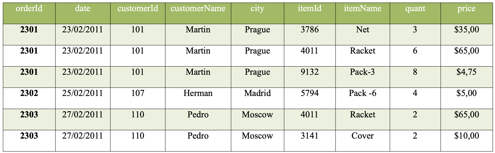
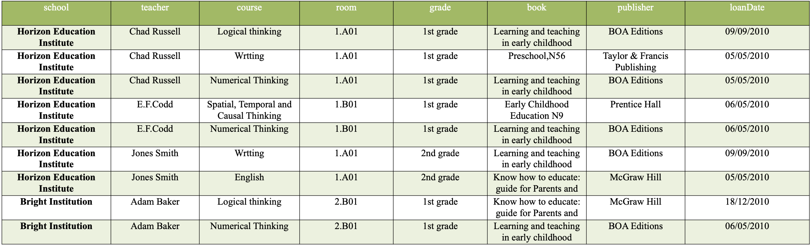

# Database normalization
## Exercise 1
Given the following relation, decompose it into 1NF, 2NF and 3NF:

Once the relationship is normalized, create a query for each of the following requirements:
- Calculate the total number of items per order and the total amount to pay for the order.
- Obtain the customer whose purchase in terms of money has been greater than the others
  
[Solution](./ex1.sql)

## Exercise 2
Given the relationship **loan_books**, it is requested to apply the normalization rules 1NF, 2NF and 3NF:

Once the relationship is normalized, create a query for each of the following requirements:
- Obtain for each of the schools, the number of books that have been loaned to each publishers.
- For each school, find the book that has been on loan the longest and the teacher in charge of it.

[Solution](./ex2.sql)
